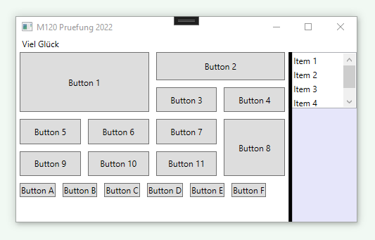

# Auftrag (WPF_FirstApp)

Verhalten:

Das Fenster hat unmittelbar nach dem Start eine Höhe von 300 Pixel und eine Breite von 500 Pixel. Das Fenster trägt den Titel «M120 Pruefung 2022». Die erste Zeile hat eine feste Höhe von 20 Pixel und enthält den Text «Viel Glück», linksbündig, Schriftgrösse 12. Auf der zweiten Zeile, linke Seite, befinden sich zwei Bereiche mit Buttons. Auf der zweiten Zeile, rechten Seite, befindet sich eine ListBox deren Grösse mittels Splitter zur Laufzeit dynamisch angepasst werden kann. Im oberen Bereich passen die Buttons ihre Grösse dynamisch im gleichen Verhältnis an. Die Buttons im unteren Bereich wandern ihre Grösse stets beibehalten automatisch auf die oberen oder unteren Zeilen, je nach Platzverhältnis. Das Verhältnis von oberen Buttons zu unteren Buttons ist 3:1. Unmittelbar nach dem Start ist das Verhältnis des linken Bereiches des Splitters zum rechten Bereich des Splitters 4:1. Das heisst die ListBox ist nach dem Start viermal kleiner als der ganze linke Bereich. Zwischen den Buttons soll ein Abstand von 5 Pixel sein. Der Abstand von Button 1 und 2 nach oben ist 0 Pixel. Die Breite des Splitter ist ebenfalls 5 Pixel sein. Achtung: Auf der linken Seite des Splitters ist der Abstand von Splitter zu den Button 2, 4 und 6 auch 5 Pixel. Auf der rechten Spalte befindet sich die Listbox im oberen Bereich. Im unteren Bereich sieht man die Hintergrundfarbe Lavender. Das Verhältnis oberer Bereich (Listbox) zum unteren Bereicht ist 1:2.

# Ergebnis

  

